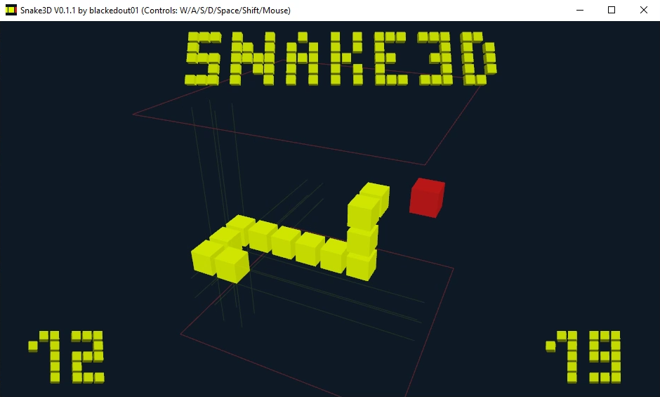

# Snake3D

Recently I stumbled upon the [Snake3D game](https://github.com/IntegratedQuantum/Snake3D) by [@IntegratedQuantum](https://github.com/IntegratedQuantum) and thought I could share my version as well.

At some point in high school we challenged each other to make a 3D snake game over the weekend because we had already mastered the 2D snake game. Even before showing each other the results in class, we talked a bit about our controls and were both left confused. The presentation was quite a surprise. Turns out, we had totally different ideas of what 3D snake actually means. [@IntegratedQuantum](https://github.com/IntegratedQuantum) made the snake move on the surface of a cube and I made the snake move inside of a cube by extending the game field into the third dimension:

### Features
The game is written in C++ and uses GLFW, glm and legacy OpenGL for cross platform windowing, maths and drawing. Please don't be too inspired, I would do this a bit differently today.
It's required to use this older release of glm, because somehow the rendering breaks when using newer ones.

You can rotate the view of the game by clicking and dragging with your mouse. Depending on this view, move left, right, forward or backward with WASD and up and down with Shift and Space.

The current score (i.e. the length of the snake) is depicted in the bottom left and the high score for this session (no save game) can be seen in the bottom right.

### How to build
Currently, only windows builds are supported, which you can do by running the `build.bat` file. To run the game just execute `Snake3D.exe`.